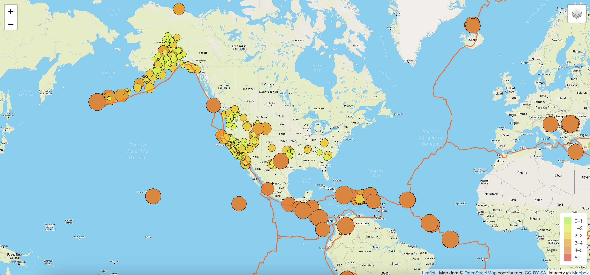

# Mapping_Earthquakes

## Summary

We used the Leaflet.js Application Programming Interface (API) to populate a geographical map with GeoJSON earthquake data from a URL. Each earthquake is visually represented by a circle and color, where a higher magnitude will have a larger diameter and will be darker in color. In addition, each earthquake will have a popup marker that, when clicked, will show the magnitude of the earthquake and the location of the earthquake. Below is an image from our app:

